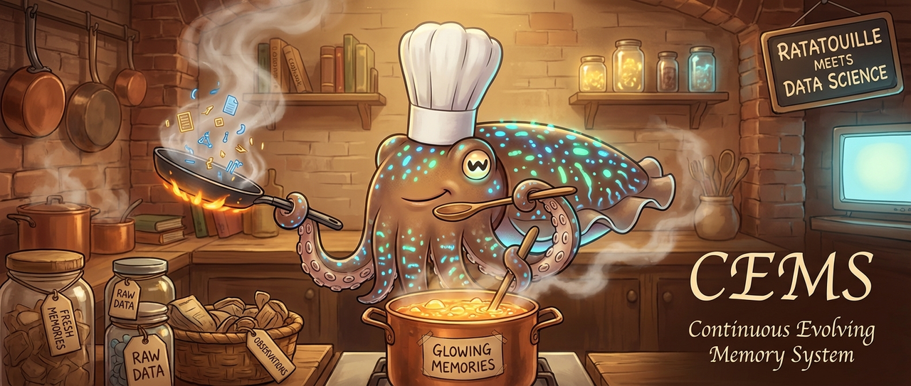
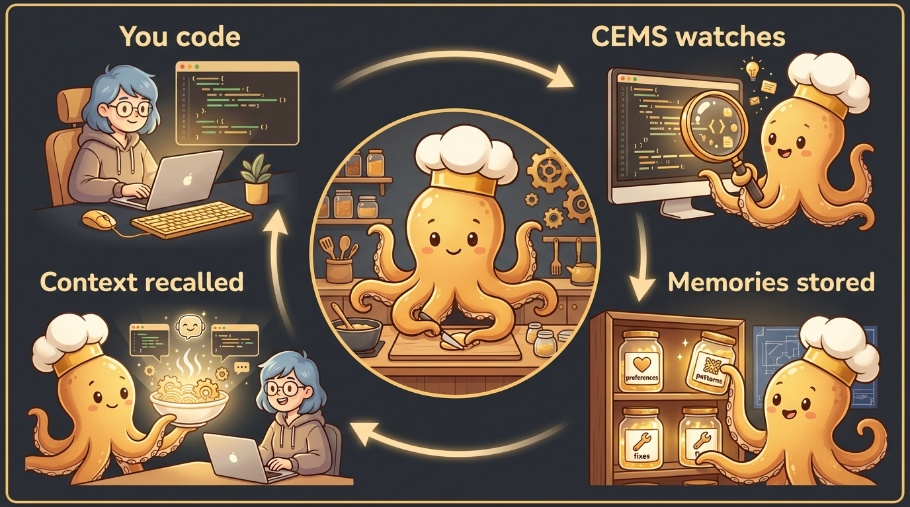
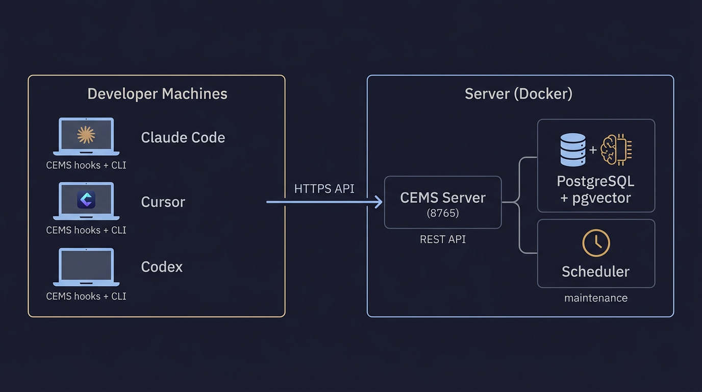

<p align="center">
  
</p>

<h1 align="center">CEMS</h1>
<p align="center"><strong>Continuous Evolving Memory System</strong></p>
<p align="center">Persistent memory for AI coding assistants. Your agent remembers what you teach it — across sessions, projects, and teams.</p>

<p align="center">
  <a href="https://opensource.org/licenses/MIT"></a>
  <a href="https://www.python.org/downloads/"></a>
  <a href="https://hub.docker.com/r/chocksy/cems-server"></a>
  <a href="https://modelcontextprotocol.io"></a>
  
</p>

<p align="center">
  Works with <strong>Claude Code</strong> · <strong>Cursor</strong> · <strong>Codex</strong> · <strong>Goose</strong> · any MCP-compatible agent
</p>

---

## How It Works

<p align="center">
  
</p>

1. **You code** — CEMS hooks into your IDE (Claude Code, Cursor, Codex, Goose)
2. **CEMS watches** — Every prompt is enriched with relevant memories. Session learnings are extracted automatically.
3. **Memories stored** — Preferences, conventions, architecture decisions, debugging fixes
4. **Context recalled** — Next session, relevant memories are injected so your agent already knows your codebase

No manual tagging. No copying context. It just works.

---

## Architecture

<p align="center">
  
</p>

---

## Quick Start

### 1. Deploy the server

```bash
# Download the compose file
curl -fsSLO https://raw.githubusercontent.com/chocksy/cems/main/deploy/docker-compose.yml

# Create .env
cat > .env << 'EOF'
POSTGRES_PASSWORD=your_secure_password
OPENROUTER_API_KEY=sk-or-your-key
CEMS_ADMIN_KEY=cems_admin_random_string
EOF

# Start
docker compose up -d

# Run migrations
for f in migrate_docs_schema.sql migrate_soft_delete_feedback.sql migrate_conflicts.sql; do
  curl -fsSL "https://raw.githubusercontent.com/chocksy/cems/main/scripts/$f" | \
    docker exec -i cems-postgres psql -U cems cems
done
```

### 2. Create users

```bash
cems admin --admin-key $CEMS_ADMIN_KEY users create alice
# Returns the API key — save it, shown only once!
```

### 3. Install the client

Each developer runs:

```bash
curl -fsSL https://getcems.com/install.sh | bash
```

Prompts for server URL and API key, then configures your IDE. Done.

---

## Documentation

| Doc | What's inside |
|-----|---------------|
| **[Deployment Guide](docs/DEPLOYMENT.md)** | Docker Compose, Kubernetes, env vars, backups, production checklist |
| **[Client Setup](docs/CLIENT.md)** | Install options, CLI commands, skills, hooks, updating, troubleshooting |
| **[Architecture](docs/ARCHITECTURE.md)** | Storage, search pipeline, maintenance, observer daemon, MCP |
| **[API Reference](docs/API.md)** | All REST endpoints with examples |

---

## Development

```bash
git clone https://github.com/chocksy/cems.git && cd cems
uv pip install -e ".[dev]"
pytest
```

## License

MIT
