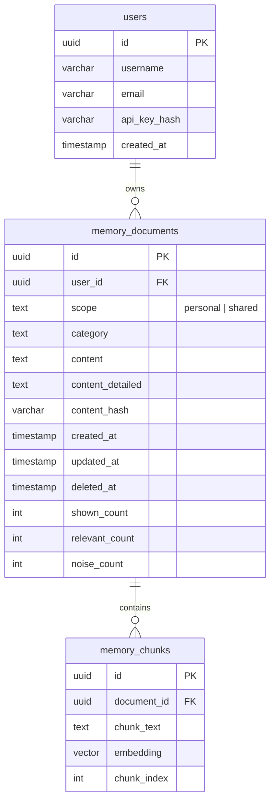

# Remove team_id from CEMS

## Overview

Remove the `team_id` concept entirely from CEMS. Replace team-gated shared memory visibility with instance-wide visibility: shared memories are visible to ALL users on the instance, personal memories remain private to the creator. Add a `CEMS_DEFAULT_SCOPE` env var so operators choose the default scope per deployment.

## Problem Statement

`team_id` adds complexity with thin value:
- Hooks don't send it (rely on server auto-resolve)
- Wiki ignores it entirely (user-scoped only)
- All maintenance jobs ignore it (run with `team_id=None`)
- Observer ignores it (stores everything as personal)
- The actual behavioral surface is a single method: `FilterBuilder.add_ownership_filter()`

The vision is simpler: one collective memory pool where shared memories are visible to everyone on the instance, and new members automatically see all shared knowledge.

## Scope

| Area | Files | Occurrences |
|------|-------|-------------|
| Source code (`src/`) | 19 files | ~178 |
| Tests (`tests/`) | 5 files | 63 |
| Scripts (`scripts/`) | 3 files | 13 |
| Deploy (`deploy/`) | 1 file | 12 |
| MCP wrapper (`mcp-wrapper/`) | 1 file | ~5 |
| **Total** | **29 files** | **~271** |

## Technical Approach

### New FilterBuilder Logic (the core behavioral change)

```
BEFORE (team-gated):
  scope="shared" → WHERE (user_id = X OR team_id = Y) AND scope = 'shared'
  scope="both"   → WHERE (user_id = X OR (team_id = Y AND scope = 'shared'))

AFTER (instance-wide):
  scope="personal"  → WHERE user_id = X AND scope = 'personal'
  scope="shared"    → WHERE scope = 'shared'
  scope="both"      → WHERE user_id = X OR scope = 'shared'
```

### New Config Field

```python
# CEMSConfig
default_scope: str = Field(default="shared", description="Default scope for new memories")
# Env var: CEMS_DEFAULT_SCOPE (default: "shared", can be "personal")
```

### Database Changes

**Tables to DROP:** `teams`, `team_members`, `api_keys`
**Columns to DROP:** `memory_documents.team_id`, `index_jobs.team_id`, `index_patterns.team_id`
**Indexes to DROP:** `memory_documents_team_id_idx`

### ERD (after refactor)



## Implementation Phases

### Phase 1: FilterBuilder & Config (core behavioral change)

The smallest unit that changes behavior. Test this in isolation first.

**Files:**

- [ ] `src/cems/db/filter_builder.py` — Rewrite `add_ownership_filter()`: remove `team_id` parameter, remove `_add_user_team_or()` helper. New logic:
  - `scope="personal"` or no scope: `WHERE user_id = $X AND scope = 'personal'`
  - `scope="shared"`: `WHERE scope = 'shared'` (no user/team filter)
  - `scope="both"`: `WHERE (user_id = $X OR scope = 'shared')`
- [ ] `src/cems/config.py` — Remove `team_id: str | None` field. Add `default_scope: str = Field(default="shared")` loaded from `CEMS_DEFAULT_SCOPE` env var
- [ ] `tests/test_document_store_shared.py` — Rewrite ownership filter tests for the new 3-case logic (personal/shared/both without team_id). This file currently has 53 team_id occurrences and needs near-complete rewrite
- [ ] `tests/test_config.py` — Remove `team_id` assertions (4 occurrences), add `default_scope` tests

**Verification:** Run `pytest tests/test_document_store_shared.py tests/test_config.py -x -q`

### Phase 2: DocumentStore (remove team_id plumbing)

Remove `team_id` parameter from all DocumentStore methods. They all delegate to FilterBuilder anyway.

**Files:**

- [ ] `src/cems/db/document_store.py` — Remove `team_id` from:
  - Column lists: `DOCUMENT_COLUMNS`, `CHUNK_WITH_DOC_COLUMNS`
  - `chunk_row_to_result()` row mapping
  - `add_document()` — stop storing team_id
  - `promote_document()` → rename to just flip scope (no team_id SET)
  - `search_chunks()`, `hybrid_search_chunks()`, `full_text_search_chunks()` — remove team_id param
  - `get_all_documents()`, `count_documents()`, `get_document_category_counts()` — remove team_id param
  - `get_project_counts()` — remove team_id param
  - `add_documents_batch()` — remove team_id param
  - `upsert_document_by_tag()` — remove team_id param

**Verification:** Run `pytest tests/ -x -q -k "document_store"` — expect some failures from callers not yet updated

### Phase 3: Memory Mixins (remove team_id propagation)

All mixins have the same pattern: `team_id = self.config.team_id if scope in ("shared", "both") else None`. Remove these lines and stop passing `team_id` to DocumentStore.

**Files:**

- [ ] `src/cems/mixins/write.py` — Remove `team_id` from `add_async()` and internal calls. Use `self.config.default_scope` when no scope is explicitly provided
- [ ] `src/cems/mixins/search.py` — Remove `team_id` from `search_async()`, `_search_raw_async()`, `_search_lexical_raw_async()`
- [ ] `src/cems/mixins/crud.py` — Remove `team_id` from `_get_all_async()`
- [ ] `src/cems/mixins/metadata.py` — Remove `team_id` from `get_category_counts_async()`

**Verification:** Run `pytest tests/ -x -q`

### Phase 4: API Layer (middleware, deps, handlers)

Remove team resolution middleware, simplify dependency injection, update handlers.

**Files:**

- [ ] `src/cems/server.py` — Remove the team resolution block from `UserContextMiddleware` (lines 165-198). Keep user auth. Remove `X-Team-Id` header reading, `TeamService.get_user_teams()` call, and auto-resolve logic
- [ ] `src/cems/api/deps.py` — Remove `request_team_id` ContextVar. Simplify `_config_for_user(user_id)` to not take `team_id`. Change cache key from `"user_id:team_id"` to just `user_id`
- [ ] `src/cems/api/__init__.py` — Remove `request_team_id` export
- [ ] `src/cems/api/handlers/memory.py`:
  - `api_memory_add`: Use `config.default_scope` when no scope provided (instead of defaulting to `"personal"`)
  - `api_memory_promote`: Simplify — just flip scope to `"shared"`, no team_id check needed. Remove the 400 error for missing team
  - `api_memory_shared_summary`: Remove the `if not team_id: return empty` check — just query `scope='shared'`
  - `api_memory_status`: Remove `team_id` from response body
  - All other handlers: remove `team_id` references
- [ ] `src/cems/api/handlers/me.py` — Remove `api_me_teams` handler (the `/api/me/teams` endpoint)
- [ ] `src/cems/api/handlers/wiki.py` — Update queries to include shared memories from all users (currently only queries `WHERE user_id = X`)
- [ ] `tests/test_server.py` — Remove `mock.config.team_id` (1 occurrence)

**Verification:** Run `pytest tests/test_server.py -x -q`

### Phase 5: Admin Layer (remove team management)

Remove all team CRUD operations. Keep user admin endpoints.

**Files:**

- [ ] `src/cems/admin/services.py` — Remove `TeamService` class entirely. Keep `UserService`
- [ ] `src/cems/admin/routes.py` — Remove all `/admin/teams/*` routes and `_resolve_team_id()` helper. Keep `/admin/users/*` routes
- [ ] `src/cems/db/models.py` — Remove `Team`, `TeamMember`, `ApiKey` SQLAlchemy models. Keep `User` model
- [ ] `tests/test_admin.py` — Remove team-related test fixtures (2 occurrences)

**Verification:** Run `pytest tests/test_admin.py -x -q`

### Phase 6: Client / CLI / MCP / Hooks

Remove team_id from all client-side code.

**Files:**

- [ ] `src/cems/client.py` — Remove `team_id` field, `X-Team-ID` header construction, team admin methods (`get_team`, `delete_team`, `add_team_member`, `remove_team_member`, `get_teams`, `create_team`)
- [ ] `src/cems/cli.py` — Remove `CEMS_TEAM_ID` from Click context loading
- [ ] `src/cems/cli_utils.py` — Remove `team_id` from CEMSClient construction
- [ ] `src/cems/commands/setup.py` — Remove `_discover_team()` function (~30 lines), remove `team_id` params from `_install_claude_hooks()`, `_install_cursor_hooks()`, `_register_claude_mcp_server()`, `_register_cursor_mcp()`. Stop writing `CEMS_TEAM_ID` to credentials
- [ ] `src/cems/mcp_stdio.py` — Remove `TEAM_ID` from `_get_config()`, remove `X-Team-Id` header from `_request()`
- [ ] `mcp-wrapper/src/index.ts` — Remove `teamId` from auth headers extraction, remove `x-team-id` forwarding from all tool proxies and resources
- [ ] `hooks/utils/credentials.py` — Remove `CEMS_TEAM_ID` from credential reading (it was already silently dropped by `CEMSClient.from_cwd()`)
- [ ] `src/cems/shared/credentials.py` — Remove `CEMS_TEAM_ID` from credential reading
- [ ] `tests/test_setup.py` — Remove team_id test cases (3 occurrences)

**Verification:** Run `pytest tests/test_setup.py -x -q`

### Phase 7: Database Migration

Add migration to `run_migrations()` in `database.py`. This runs on Docker startup BEFORE the server starts.

**CRITICAL:** This migration MUST be in `run_migrations()` — not just in SQL scripts. Incident precedent: `memory_conflicts` table was missing from `run_migrations()` and caused 500 errors on 2026-04-15.

**Migration SQL** (new entry in `run_migrations()`):

```python
("remove_team_id_v1", """
    -- Drop team_id from memory_documents
    DROP INDEX IF EXISTS memory_documents_team_id_idx;
    ALTER TABLE memory_documents DROP COLUMN IF EXISTS team_id;

    -- Drop team_id from index tables
    ALTER TABLE index_jobs DROP COLUMN IF EXISTS team_id;
    ALTER TABLE index_patterns DROP CONSTRAINT IF EXISTS index_patterns_team_id_name_key;
    ALTER TABLE index_patterns DROP COLUMN IF EXISTS team_id;

    -- Drop scope constraint and recreate without 'team' and 'company'
    ALTER TABLE memory_documents DROP CONSTRAINT IF EXISTS valid_doc_scope;
    ALTER TABLE memory_documents ADD CONSTRAINT valid_doc_scope
        CHECK (scope IN ('personal', 'shared'));

    -- Change default scope to 'shared'
    ALTER TABLE memory_documents ALTER COLUMN scope SET DEFAULT 'shared';

    -- Drop team-related tables (FK constraints cascade)
    DROP TABLE IF EXISTS api_keys CASCADE;
    DROP TABLE IF EXISTS team_members CASCADE;
    DROP TABLE IF EXISTS teams CASCADE;
""")
```

**Files:**

- [ ] `src/cems/db/database.py` — Add `remove_team_id_v1` migration entry. Note: the existing `core_memory_tables_v1` migration still creates the column, but since migrations are tracked and idempotent, the new migration runs after it and drops the column

**Verification:** Rebuild and restart Docker: `docker compose build cems-server && docker compose up -d cems-server`. Check logs for successful migration: `docker logs cems-server --tail 20`

### Phase 8: Reference Docs & Cleanup

Update non-executed reference files for consistency.

**Files:**

- [ ] `deploy/init.sql` — Remove `teams`, `team_members`, `api_keys` table definitions. Remove `team_id` column from `memory_documents`. Update scope constraint. Update default scope
- [ ] `scripts/migrate_docs_schema.sql` — Remove `team_id` references
- [ ] `scripts/migrate_to_pgvector.py` — Remove `team_id` references (legacy script)
- [ ] `scripts/backfill_docs_from_memories.py` — Remove `team_id` references (legacy script)
- [ ] `src/cems/data/claude/skills/cems/share.md` — Update docs: remove "Requires CEMS_TEAM_ID" note
- [ ] Mark **CX3** from `docs/plans/2026-04-03-refactor-code-review-remediation-plan.md` as obsolete (it asked to plumb CEMS_TEAM_ID through stdio MCP — now superseded)

**Verification:**
- Run full test suite: `pytest tests/ -x -q`
- Verify zero remaining references: `grep -r "team_id" src/ --include="*.py" | grep -v __pycache__` should return empty
- Verify zero remaining references in TS: `grep -r "team" mcp-wrapper/src/ | grep -v node_modules` should return empty

## Acceptance Criteria

### Functional Requirements

- [ ] New memories default to `scope="shared"` (configurable via `CEMS_DEFAULT_SCOPE` env var)
- [ ] Shared memories are visible to ALL authenticated users on the instance
- [ ] Personal memories remain visible only to the creator
- [ ] Promote endpoint works (flips scope from personal to shared, no team_id needed)
- [ ] Shared summary endpoint returns data (no longer requires team context)
- [ ] Wiki pages can include shared memories from all users
- [ ] `cems setup` no longer prompts for team selection
- [ ] MCP tools work without X-Team-Id header

### Non-Functional Requirements

- [ ] No `team_id` references in source code (`src/`, `mcp-wrapper/src/`)
- [ ] Migration runs successfully on Docker startup
- [ ] All 577+ existing tests pass (with updates)
- [ ] No N+1 or performance regression from removing team_id filter

### Rollback

Atomic deployment: if the new Docker image fails, revert to the previous image. The old migration ID won't be in `schema_migrations`, so the old code works unchanged. However, if the new migration HAS run and dropped the column, rolling back to old code will break (old code expects `team_id` to exist). **This is a one-way migration** — plan accordingly with staging verification first.

## Dependencies & Risks

| Risk | Severity | Mitigation |
|------|----------|-----------|
| FilterBuilder change silently breaks memory isolation | Medium | Unit test the 3 cases exhaustively in Phase 1 before touching callers |
| Migration FK order causes DROP TABLE failure | Medium | Use `CASCADE` on DROP TABLE statements |
| One-way migration (can't rollback after column drop) | Low | Test on staging/Docker locally first |
| `test_document_store_shared.py` rewrite misses edge cases | Medium | Rewrite tests to cover: personal-only user, shared-only query, both-scope query, empty results |
| `index_patterns` UNIQUE constraint includes team_id | Low | Drop constraint before dropping column (handled in migration SQL) |

## References

- Brainstorm: `docs/brainstorms/2026-04-15-remove-team-id-brainstorm.md`
- Migration incident: `memory_conflicts` table missing from `run_migrations()` (2026-04-15)
- Code review remediation: `docs/plans/2026-04-03-refactor-code-review-remediation-plan.md` (CX3 now obsolete)
- FilterBuilder: `src/cems/db/filter_builder.py` — `add_ownership_filter()` method
- DocumentStore: `src/cems/db/document_store.py` — 12 methods with team_id param
- Migration system: `src/cems/db/database.py:166` — `run_migrations()` function
